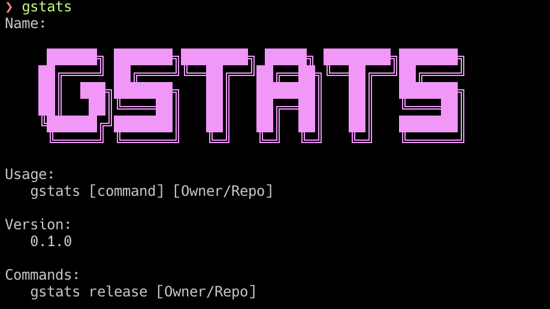

# gstats

CLI tool for Github statistics written in Rust



## Build
```bash
$ cargo build --release
```

## Usage
```bash
$ export GITHUB_TOKEN="xxxxxxxxxxxxxxxxxx"
$ gstats
$ gstats release ksk001100/gstats
$ gstats clone ksk001100/gstats
$ gstats view ksk001100/gstats
```
